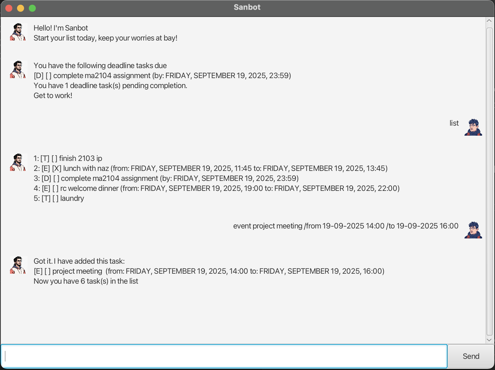

# Sanbot User Guide

Sanbot is your personal task management chatbot that helps you organize your to-dos, deadlines, and events efficiently. Simply chat with Sanbot using natural commands to manage your tasks seamlessly.

## Quick Start

1. Start chatting with Sanbot by typing any of the commands below
2. Type `bye` when you're done to close the application
3. Your tasks are automatically saved locally



## Command Format Notes

* Words in `UPPER_CASE` are parameters you need to provide. e.g. in `todo TASK_DESCRIPTION`, you replace `TASK_DESCRIPTION` with your actual task.
* Items in angle brackets `< >` are required parameters that must be provided.
* Date format must be `dd-MM-yyyy HH:mm` (e.g., `25-12-2024 14:30` for December 25, 2024, at 2:30 PM).

## Features

### Viewing All Tasks

Lists all your current tasks with their status and details.

**Command:** `list`

**Expected Output:**
```
Here are the tasks in your list:
1. [T][ ] Read book
2. [D][X] Submit assignment (by: Dec 25 2024, 2:30 PM)
3. [E][ ] Team meeting (from: Dec 26 2024, 9:00 AM to: Dec 26 2024, 10:00 AM)
```

### Adding To-Do Tasks

Creates a simple task without any time constraints.

**Command:** `todo <TASK_DESCRIPTION>`

**Example:** `todo Read book`

**Expected Output:**
```
Got it. I've added this task:
  [T][ ] Read book
Now you have 1 task in the list.
```

### Adding Tasks with Deadlines

Creates a task that must be completed by a specific date and time.

**Command:** `deadline <TASK_DESCRIPTIONn> /by <dd-MM-yyyy HH:mm>`

**Example:** `deadline Submit assignment /by 25-12-2024 14:30`

**Expected Output:**
```
Got it. I've added this task:
  [D][ ] Submit assignment (by: Dec 25 2024, 2:30 PM)
Now you have 2 tasks in the list.
```

### Adding Event Tasks

Creates a task that occurs within a specific time period.

**Command:** `event <TASK_DESCRIPTION> /from <dd-MM-yyyy HH:mm> /to <dd-MM-yyyy HH:mm>`

**Example:** `event Team meeting /from 26-12-2024 09:00 /to 26-12-2024 10:00`

**Expected Output:**
```
Got it. I've added this task:
  [E][ ] Team meeting (from: Dec 26 2024, 9:00 AM to: Dec 26 2024, 10:00 AM)
Now you have 3 tasks in the list.
```

### Marking Tasks as Done

Marks a task as completed using its position in the list.

**Command:** `mark <TASK NO.>`

**Example:** `mark 2`

**Expected Output:**
```
Nice! I've marked this task as done:
  [D][X] Submit assignment (by: Dec 25 2024, 2:30 PM)
```

### Marking Tasks as Not Done

Marks a previously completed task as incomplete.

**Command:** `unmark <TASK NO.>`

**Example:** `unmark 2`

**Expected Output:**
```
OK, I've marked this task as not done yet:
  [D][ ] Submit assignment (by: Dec 25 2024, 2:30 PM)
```

### Deleting Tasks

Permanently removes a task from your list.

**Command:** `delete <TASK NO.>`

**Example:** `delete 3`

**Expected Output:**
```
Noted. I've removed this task:
  [E][ ] Team meeting (from: Dec 26 2024, 9:00 AM to: Dec 26 2024, 10:00 AM)
Now you have 2 tasks in the list.
```

### Finding Tasks

Searches for tasks containing a specific keyword (case-insensitive).

**Command:** `find <KEYWORD>`

**Example:** `find book`

**Expected Output:**
```
Here are the matching tasks in your list:
1. [T][ ] Read book
```

### Saving and Exiting

Saves your current task list locally and closes the Sanbot window.

**Command:** `bye`

**Expected Output:**
```
Your tasks have been saved. See you soon!
Sanbot window closing in
4...3...2...1...
```

## Task Status Indicators

* `[T]` - To-do task
* `[D]` - Deadline task
* `[E]` - Event task
* `[X]` - Task completed
* `[ ]` - Task not completed yet

## Tips

* Task numbers change when you delete tasks, so always check with `list` first
* Use the `find` command to quickly locate specific tasks in a long list
* Your tasks are automatically saved, so you won't lose your progress between sessions